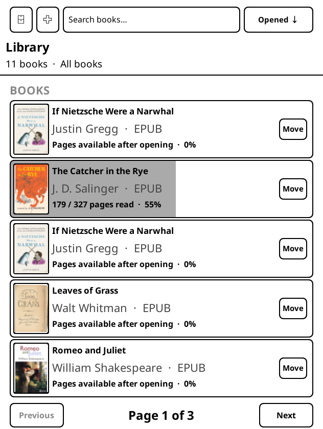
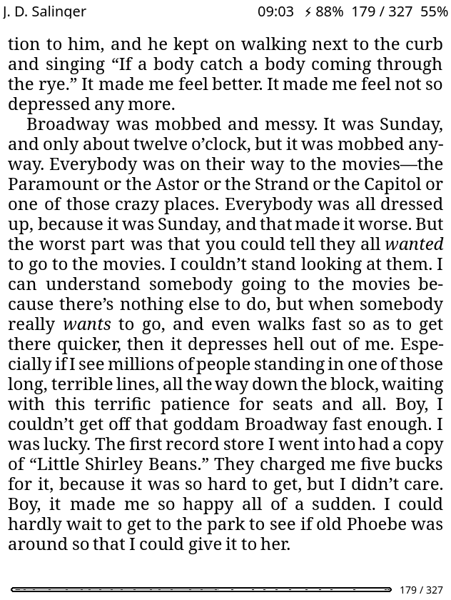
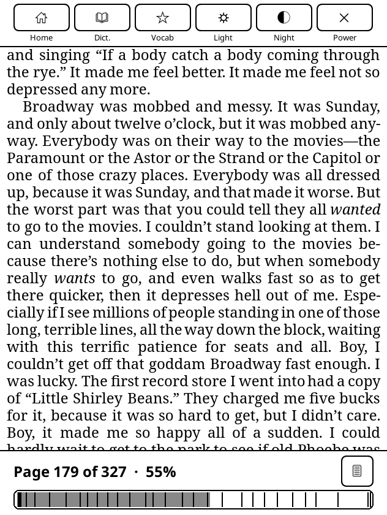

# HongReader

HongReader is a clean, e-ink-focused library and reader interface for
[KOReader](https://github.com/koreader/koreader) on Kindle Paperwhite.

It replaces KOReader's normal file browser with a cover-based library, keeps
the most useful reader controls close at hand, and is designed around compact
grayscale layouts that remain readable on an e-ink screen.



## Highlights

- Five compact book cards per page with cover art, pages read, total pages,
  percentage, and card-wide grayscale progress.
- Search plus newest-added and recently-opened sorting.
- Nested categories that can be created, removed, and reorganized on-device.
- A draggable page slider with live shading and a minimal chapter-marked
  reading-progress strip.
- Compact top and bottom drawers for lighting, night mode, dictionary,
  vocabulary, page setup, navigation, and Kindle power actions.
- A consistent font-size default for reflowable books.
- A direct return to the custom library without flashing KOReader's stock file
  manager.
- Kindle-aware sizing for the reader header and battery display.

## Requirements

- A Kindle capable of running KOReader.
- A working KOReader installation.
- For the optional home-screen launcher, KPM/KMC with the `kpm` command at
  `/var/local/kmc/bin/kpm`.

## Install the plugin

Copy the complete `library.koplugin` directory to:

```text
/mnt/us/koreader/plugins/library.koplugin
```

The installed source should end up at:

```text
/mnt/us/koreader/plugins/library.koplugin/main.lua
```

Remove an older `minimal_library.koplugin` directory if one exists, then
restart KOReader.

### Windows MTP updater

After the plugin directory exists on the Kindle, a Windows computer can update
`main.lua`, back up the previous copy, and verify the read-back hash with:

```powershell
powershell.exe -NoProfile -ExecutionPolicy Bypass -File .\scripts\Deploy-LibraryPlugin.ps1
```

Local backups and verification files are stored below `.local/`, which is not
committed to Git.

## Optional Kindle home-screen launcher

Copy both of these entries into the Kindle's `documents` directory:

```text
launcher/HongReader.sh
launcher/HongReader.sh.sdr/
```

The black-cover `HongReader` document then launches KOReader through KPM.

## Reader interface



Swipe down for the top drawer and swipe up for the page slider and page-setup
control.



## Project layout

```text
library.koplugin/   KOReader plugin source
launcher/           Optional Kindle document launcher and cover
scripts/            Windows MTP deployment helper
docs/screenshots/   Interface previews
```

## Notes

HongReader stores its library preferences through KOReader and uses KOReader's
existing per-book metadata. Back up your Kindle before testing development
builds. This repository intentionally does not contain books, reading-progress
sidecars, device backups, logs, or jailbreak/install packages.
